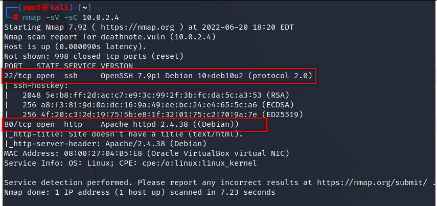

# Deathnote CTF Writeup

CTF link: 

[Deathnote: 1](https://www.vulnhub.com/entry/deathnote-1,739/)

- We launched target machine and our kali and opened terminal as root.
- Check ifconfig and grab your ip address and start a scan.

> netdiscover -r xx.xx.xx.0/24
> 
- Pick the ip address and copy it.

We have to check ip for which ports runs which apps.

- First we check nmap

> nmap -sV -sC xx.x.x.x

  

- We see our ip runs ssh at port 22 and http at port 80

We see that http port, we should check our ip address if it runs a website.

  

It runs but redicts to deathnote.vuln/wordpress so we should add our ip as this link to /etc/hosts file. We mapped our target ip address to deathnote.vuln.

> echo “10.0.2.4 deathnote.vuln” > /etc/hosts
> 

  

We have a wordpress website, we should use wpscan but first let’s check /wp-content/uploads where every file uploaded file’s storage. 

  

Okey we found these two files, probably we found usernames and passwords for brute-force attack. We have a website and a ssh connection. We will attack them till we found something. So we copy these two files to our file named “deathnote” (just for being organized).

We should check wpscan for another details.

> wpscan —url http://deathnote.vuln/wordpress
> 

  

Nothing interesting, so we will try usernames and passwords for wp-admin or wp-login (wordpress login pages for default).

> wpscan -U user.txt -P pass.txt --url http://deathnote.vuln/wordpress/ --password-attack wp-login
> 

  

We couldn’t find a combination so we can try to attack ssh. We will use “hydra” tool.

> hydra -L user.txt -P pass.txt ssh://10.0.2.4
> 

  

We found a combination, we can connect the server with ssh.

> ssh l@10.0.2.4
> 

  

Can we run sudo? No…

  

When we check what is there we found user.txt which written with brainfuck language. We will use online tools to decode.

  

  

Kira approved that we found the shell, we will go and go back and go back and try to find a useful file/files for any clue.

  

Okey, we found something. Check the fake-notebook-rule folder.

  

  

We found a password for probably kira. 

  

We found something, maybe root’s password. Try it.

  

Can we “sudo su root” just for try

  

We got it.

  
