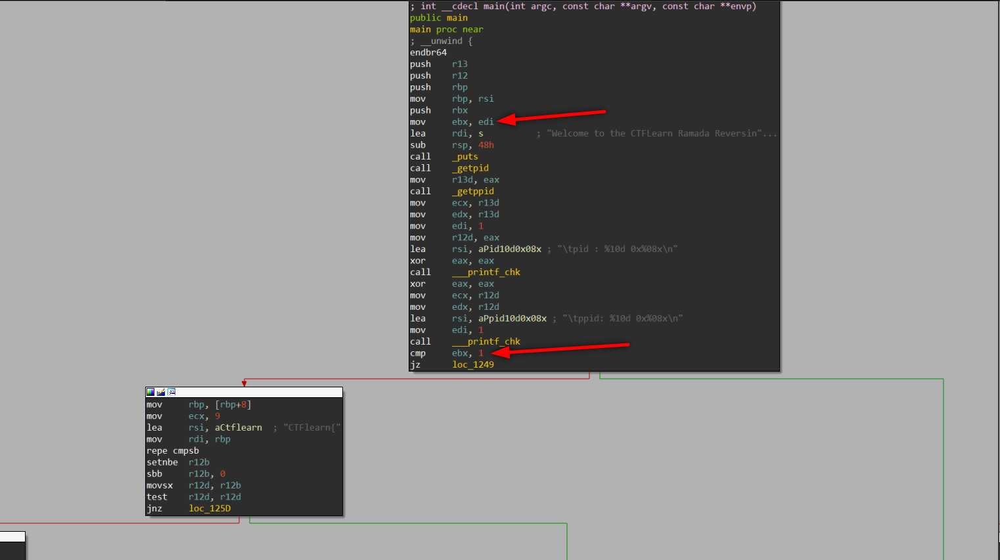

# Ramada CTF Write-up (Reverse Engineering)

Ctf link: [Ramada](https://ctflearn.com/challenge/1009)

<p align="center">  </p>

> Pseudocode created by IDA Pro is given at the bottom of the post.
> 

The program check argc value and jumps another branch. If argc value is equal to 1, program prints insturactions; if argc value is not equal to 1 program controls first 9 byte of input. 

<p align="center">  </p>

In the next node program calls **_strlen** and save the result at rax. After checking the last byte of input program compares rax with hex: 1F decimal: 32.  

```c
lea     rsi, [rbp+9]    ; src // our string
mov     edx, 15h        ; n // extracted input length
rep stosd
mov     rdi, r13        ; dest // r13 set as destination will be write
call    _strncpy        ; strncpy // this call will write 21 byte starting from input+9   
mov     edi, 1
xor     eax, eax
mov     rdx, r13        ; // set rdx to r13 which is out flag's 9. to 31. position
lea     rsi, aYourFlagKernel ; "Your Flag Kernel: %s\n"
call    ___printf_chk
mov     rdi, r13        ; char * // set rdi which will be sent with CheckFlag function
call    _Z9CheckFlagPKc ; CheckFlag(char const*)
```

So our flag can be like this: CTFlearn{aaaaaaaaaaaaaaaaaaaaa}

<p align="center">  </p>

We see two call functions here, first fill data section with words (4 byte). When we follow the section with IDA we see data but I prefer gdb output because we will use a fuzzer script.

<p align="center">  </p>

We add breakpoint to CheckFlag(char const*), and execute code with flag we created.

```c
pwndbg> b *CheckFlag(char const*)
pwndbg> r CTFlearn{aaaaaaaaaaaaaaaaaaaaa}
```

<p align="center">  </p>

<p align="center">  </p>

Here program controls input^3 in a for loop. We write a script to brute-force to find chars in this data. This script will try all ascii letters, digits and some other chars.

```python
#!/usr/bin/env python3

ascii_letters = 'abcdefghijklmnopqrstuvwxyzABCDEFGHIJKLMNOPQRSTUVWXYZ'
digits = '0123456789'

data = [0]*21

data = [0x00013693,	0x0006b2c0,	0x0011a9f9,	0x00157000,
0x0001cb91,	0x001bb528,	0x001bb528,	0x000ded21,
0x00144f38,	0x000fb89d	,0x00169b48,	0x000d151f,
0x0008b98b,	0x0017d140,	0x000ded21,	0x001338c0,
0x001338c0,	0x0011a9f9,	0x0001b000	,0x00144f38,
0x001734eb]

flag = "CTFlearn{"

candidates = ascii_letters+digits+'+'+'_'+'-'

for i in range(len(data)):
    for j in candidates:
        if pow(ord(j),3) == data[i]:
            flag += j
            break

print(flag+'}')
```

<p align="center">  </p>

```c
int __cdecl main(int argc, const char **argv, const char **envp)
{
  unsigned int v3; // r13d
  unsigned int v4; // r12d
  const char *v5; // rbp
  bool v6; // zf
  int v7; // r12d
  size_t v8; // rax
  __int64 v9; // rcx
  char *v10; // rdi
  char v12[104]; // [rsp+0h] [rbp-68h] BYREF

  puts("Welcome to the CTFLearn Ramada Reversing Challenge!");
  v3 = getpid();
  v4 = getppid();
  __printf_chk(1LL, "\tpid : %10d 0x%08x\n", v3, v3);
  __printf_chk(1LL, "\tppid: %10d 0x%08x\n", v4, v4);
  if ( argc == 1 )
  {
    v7 = 1;
    puts("Usage: Ramada CTFlearn{kernel}");
  }
  else
  {
    v5 = argv[1];
    v6 = memcmp("CTFlearn{", v5, 9uLL) == 0;
    v7 = !v6;
    if ( v6 )
    {
      v8 = strlen(v5);
      if ( v5[v8 - 1] == 125 )
      {
        if ( v8 == 31 )
        {
          InitData();
          v9 = 16LL;
          v10 = v12;
          while ( v9 )
          {
            *(_DWORD *)v10 = v7;
            v10 += 4;
            --v9;
          }
          strncpy(v12, v5 + 9, 0x15uLL);
          __printf_chk(1LL, "Your Flag Kernel: %s\n", v12);
          if ( !(unsigned int)CheckFlag(v12) )
            __printf_chk(1LL, "Woot Woot! You found the flag! %s\n", v5);
          puts("All Done Ramada!");
        }
        else
        {
          v7 = 4;
          puts("Your flag is the wrong length dude!");
        }
      }
      else
      {
        v7 = 3;
        puts("Error: Your flag must end with '}'");
      }
    }
    else
    {
      v7 = 2;
      puts("Error: Your flag must start with CTFlearn{");
    }
  }
  return v7;
}
```

```c
__int64 __fastcall CheckFlag(const char *a1)
{
  __int64 i; // rax

  for ( i = 0LL; i != 21; ++i )
  {
    if ( *((_DWORD *)&data + i) != a1[i] * a1[i] * a1[i] )
    {
      puts("No flag for you!");
      return 4LL;
    }
  }
  return 0LL;
}
```