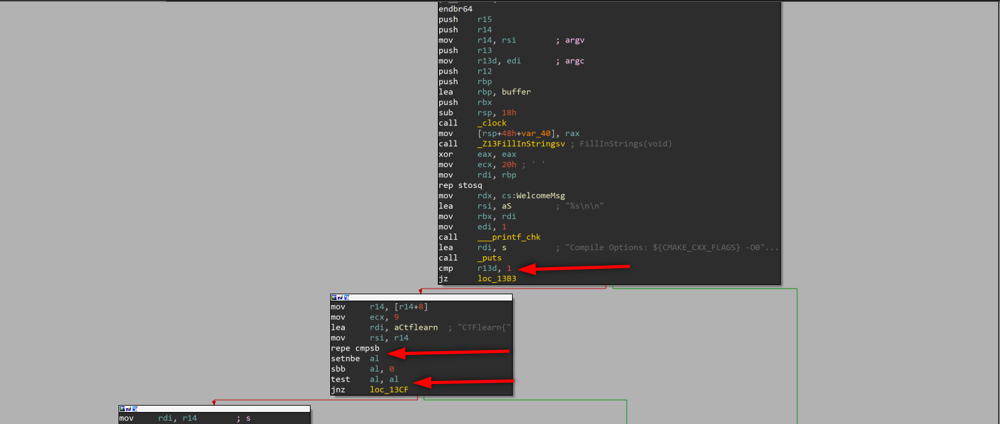

# Rangoon CTF Write-up (Reverse Engineering)

CTF link: [Rangoon](https://ctflearn.com/challenge/994)

<p align="center">  </p>

> Pseudocode created by IDA Pro is given at the bottom of the post.
> 

cmp checks if **edi == 1 or edi != 1** and sets ZF (zero flag). We know that argc (argument counter) is stored in edi, so if we give an argument we can jump to False branch (argc will be 2 when we give 1 argument, because in the command line first argument is our file. When we execute file without any arguments, argc set 1.)

test checks **al** value and sets ZF like cmp, **al** value set by **seta** after **repe.** If we give argument starting with “CTFLearn{”  **al** will be set 1 (because ZF = 1), and **test al,al**  sets ZF = 1, we can jump to False branch.

<p align="center">  </p>

we see that empty r15d with **xor r15d, r15d** and **_strlen** call. Then **cmp rax, 1Ch**. **_strlen** function stores lenght of input to **rax**, after **_strlen** assign **rax** we see one more **cmp** function which controls last byte of our argument, if last char is “}” then ZF = 1. Up to this point our program controlled first 9 char (CTFLearn{) and last char (}) so our flag should be like this: CTFLearn{………..}. Program checked usage instructions.

We have to careful about this section.

<p align="center">  </p>

When we staticly debugging the program we can not see the stack and its variables mostly. Because variables, strings mostly stored another place and adding to stack in the runtime. So while inspecting code, we should have full knowladge of which function will be affect on the program,  changes what. 

This **strings** section is written in runtime, when we check it staticly we can not see the context. 

<p align="center">  </p>

But if we can find the function adds data in this section, we can find what is inside that. 

<p align="center">  </p>

<p align="center">  </p>

<p align="center">  </p>

<p align="center">  </p>

<p align="center">  </p>

We found **strings** context, we should follow the code line by line and create the flag. First of all we our flag starts with “CTFlearn{” and ends with “}”. Also flag’s lenght is hex: 0x1C binary: 28. When we check the last box of tree we can see these **cmp** instruction, these are check “_” char is located right place. If we don’t place them and try to enter a flag like “CTFlearn{aaaaaaaaaaaaaaaaaa}”  program creates wrong flag.

<p align="center">  </p>

But if we create a wrong flag but with a right way we can see that program creates real flag for last cmp instruction, at least some info about the flag.

We can execute code with this argument: CTFlearn{aaaaaaaa_aaaa_aaaa}

<p align="center">  </p>

## IDA Pro Pseudocode

```c
int __cdecl main(int argc, const char **argv, const char **envp)
{
  int v3; // r13d
  char *v4; // rbx
  const char *v5; // r14
  size_t v6; // rax
  __int64 v7; // r15
  __int64 v8; // rdx
  _BOOL4 v9; // r13d
  char *v10; // rdi
  __int64 v11; // r12
  __int64 v12; // rax
  __int64 v13; // rax
  __int64 v14; // rax
  __int64 v15; // rax
  __int64 v16; // rax
  clock_t v17; // rax
  clock_t v19; // [rsp+8h] [rbp-40h]

  v3 = argc;
  v19 = clock();
  FillInStrings();
  memset(buffer, 0, 0x100uLL);
  v4 = &buffer[256];
  __printf_chk(1LL, "%s\n\n", WelcomeMsg);
  puts("Compile Options: ${CMAKE_CXX_FLAGS} -O0 -fno-stack-protector -mno-sse");
  if ( argc == 1 )
  {
    __printf_chk(1LL, "%s\n\n", UsageMsg);
  }
  else
  {
    v5 = argv[1];
    if ( !memcmp(v5, "CTFlearn{", 9uLL) )
    {
      v6 = strlen(v5);
      v7 = 3 * (unsigned int)(v6 == 28) + 9;
      if ( v5[v6 - 1] == 125 )
      {
        v8 = (unsigned int)(v5[17] == 95) + 2;
        v9 = v5[22] == 95;
        v10 = &buffer[strlen(buffer)];
        *(_QWORD *)v10 = 0x6E7261656C465443LL;
        v11 = strings;
        v10 += 9;
        *(_WORD *)(v10 - 1) = 123;
        v12 = __stpcpy_chk(v10, *(_QWORD *)(v11 + 8 * v8), v4 - v10);
        v13 = __memcpy_chk(v12, "_", 2LL, &v4[-v12]);
        v14 = __stpcpy_chk(v13 + 1, *(_QWORD *)(v11 + 8LL * (unsigned int)(5 * v9 + 3)), (char *)&unk_41DF - v13);
        v15 = __memcpy_chk(v14, "_", 2LL, &v4[-v14]);
        v16 = __stpcpy_chk(v15 + 1, *(_QWORD *)(v11 + 8 * v7), (char *)&unk_41DF - v15);
        if ( __memcpy_chk(v16, "}", 2LL, &v4[-v16]) + 1LL - (_QWORD)buffer == 28 )
        {
          v3 = strcmp(v5, buffer);
          if ( v3 )
          {
            v3 = 5;
            __printf_chk(1LL, "%s\n\n", WrongFlagMsg);
          }
          else
          {
            __printf_chk(1LL, "%s %s\n\n", CongratsMsg, v5);
            v17 = clock();
            __printf_chk(1LL, "Elapsed time in clock ticks: %ld\n", v17 - v19);
            __printf_chk(1LL, "%s\n\n", AllDoneMsg);
          }
        }
        else
        {
          v3 = 3;
          __printf_chk(1LL, "%s\n\n", WrongFlagMsg);
        }
      }
      else
      {
        v3 = 4;
        __printf_chk(1LL, "%s\n\n", WrongFlagMsg);
      }
    }
    else
    {
      v3 = 2;
      __printf_chk(1LL, "%s\n\n", WrongFlagMsg);
    }
  }
  return v3;
}
```